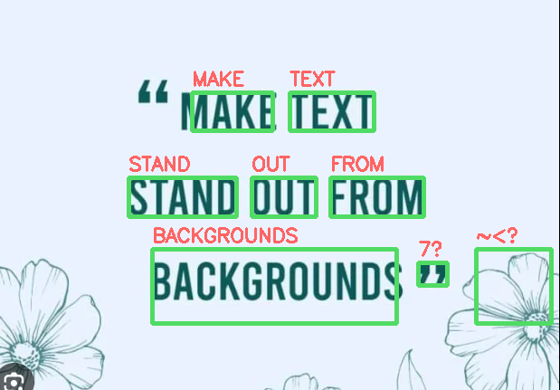

# Printed Text Scanner (OCR Tool)  
**Real-time OCR with ROI selection • Built with PyQt5 + OpenCV + Tesseract**

A beautiful, modern desktop application that lets you extract printed text from images or live camera feed using **Tesseract OCR**, with manual **Region of Interest (ROI)** selection and visual bounding box overlay.

  
*(Add a screenshot of your app here for best results)*


### Features
- Load images from disk
- Live camera preview & frame capture
- Draw custom ROI (drag with mouse) to focus OCR on specific areas
- High-quality text extraction with confidence filtering
- Visual overlay of detected text boxes
- Save result image with bounding boxes
- Clean, dark-themed modern UI

---

### Requirements

#### Python Packages (install all at once):
```
pip install opencv-python numpy Pillow pytesseract PyQt5
```
---

#### Tesseract OCR Engine (Windows)
1. Download from:  
   https://github.com/UB-Mannheim/tesseract/wiki
2. Run the installer (recommended path: `C:\Program Files\Tesseract-OCR\`)
3. No extra steps needed — the app automatically finds it!

> The code already includes:
> ```python
> pytesseract.pytesseract.tesseract_cmd = r"C:\Program Files\Tesseract-OCR\tesseract.exe"
> ```

---

### How to Run

1. Save the script as `index.py`
2. Open terminal/command prompt in the folder
3. Run:
```bash
python index.py
```

The app will launch instantly!

---

### How to Use (GUI Guide)

| Action                     | How to Do It                                      |
|---------------------------|----------------------------------------------------|
| **Load an image**         | Click **"Load Image"** → select JPG/PNG/BMP       |
| **Use camera**            | Click **"Start Camera"** → live preview appears   |
| **Capture current frame** | Click **"Capture Frame"** while camera is on      |
| **Select text area**      | **Click and drag** on the image to draw a green rectangle (ROI) |
| **Clear selection**       | Click **"Clear ROI"**                             |
| **Run OCR**               | Click **"Run OCR"** → text appears on the right + boxes on image |
| **Save result**           | Click **"Save Result"** → saves image with green boxes |

**Tip**: You can run OCR on the **whole image** (no ROI) or just your selected region.

---

### Example Workflow

1. Click **Start Camera** or **Load Image**
2. (Optional) Draw a rectangle around the text you want
3. Click **Run OCR**
4. Read extracted text on the right panel
5. Click **Save Result** to export the annotated image

---

### Troubleshooting

| Problem                         | Solution |
|---------------------------------|----------|
| `TesseractNotFoundError`        | Install Tesseract from the link above |
| Camera not opening              | Try closing other apps using webcam |
| Blurry/noisy OCR results        | Use good lighting, select ROI carefully |
| App looks weird on high-DPI     | Works best with Windows scaling ≤ 125% |

---

### Tech Stack
- **GUI**: PyQt5 (Fusion dark theme)
- **Image Processing**: OpenCV
- **OCR Engine**: Tesseract 5 + pytesseract
- **Language**: Python 3.7+

---

### Author
DUFITIMANA Theoneste • 2025

Enjoy scanning text like a pro!
